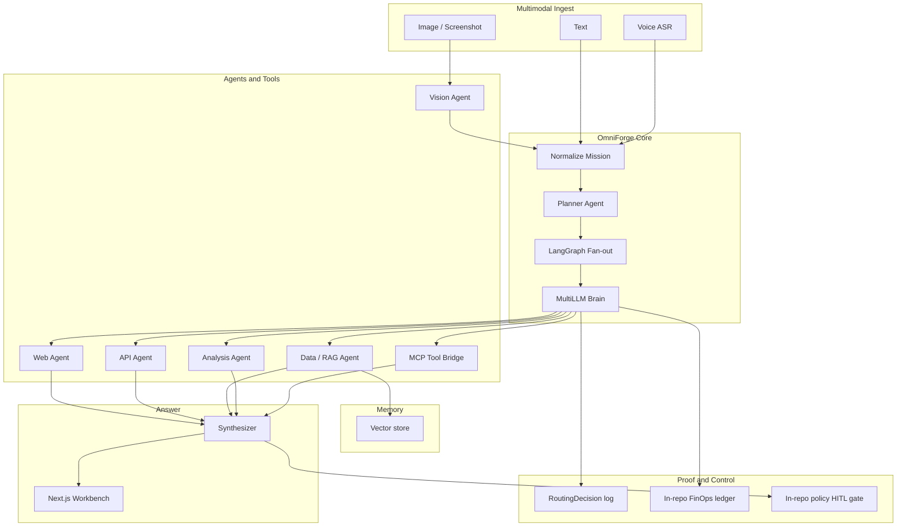

# OmniForge


<!-- vpeetla-tech-stack:start -->
[]() []() []() []() []() []()
<!-- vpeetla-tech-stack:end -->

[](https://omniforge-flame.vercel.app)
[](https://omniforge-api.onrender.com/health)
[](LICENSE)
[](https://github.com/vpeetla-ai)

**Ask anything. Right agents. Right models.**

Self-contained **multimodal multi-agent multi-LLM** answer platform — text, image/screenshot, and voice fan out across specialized agents and MCP tools, with a live **model waterfall** proving which model ran each step.

> **Self-contained:** no runtime dependency on other vpeetla-ai services. FinOps ledger, policy gate, RAG, voice ingest, and MCP bridge all live in this monorepo.

[▶ Live demo](https://omniforge-flame.vercel.app) · [API health](https://omniforge-api.onrender.com/health) · [Architecture](docs/ARCHITECTURE.md) · [ADR-027](https://github.com/vpeetla-ai/ai-architecture-portfolio/blob/main/adr/ADR-027-omniforge-self-contained-multimodal-multi-llm.md)

## Architecture

Full write-up: [`docs/ARCHITECTURE.md`](docs/ARCHITECTURE.md) · Canonical diagram: [`docs/diagrams/canonical-architecture.mmd`](docs/diagrams/canonical-architecture.mmd)



## Honest status

| Component | Status | Notes |
|-----------|--------|-------|
| Multimodal ingest (text / image / voice transcript) | ✅ | Browser ASR supplies transcript; optional Whisper later |
| Planner fan-out | ✅ | Selects vision/web/api/data/analysis + MCP tools |
| Multi-LLM Brain (task-class buckets) | ✅ | fast / structured / reasoning / vision |
| Provider cascade (Groq / OpenAI / Anthropic / Google / mock) | ✅ | Missing keys fall through; mock never claimed as live |
| Parallel agents + synthesizer | ✅ | Async gather mid-agents |
| In-process MCP tool bridge | ✅ | time, echo, calc, allowlisted http_get |
| In-memory RAG | ✅ | Qdrant URL optional |
| In-repo FinOps budget halt | ✅ | `OMNIFORGE_BUDGET_USD` |
| In-repo export gate + `PRODUCTION_STRICT` | ✅ | No AegisAI dependency |
| A/B single vs routed | ✅ | `POST /v1/ask/ab` |
| Next.js Ask workbench | ✅ | [omniforge-flame.vercel.app](https://omniforge-flame.vercel.app) |
| Live API on Render | ✅ | [omniforge-api.onrender.com](https://omniforge-api.onrender.com/health) · set `OMNIFORGE_MODE=live` |
| Server Whisper ASR / edge-tts | 🟡 | Browser path ships; server optional |
| External MCP servers | ⬜ | In-process bridge first |
| `omniforge.vercel.app` without SSO | 🟡 | Disable Vercel Deployment Protection for public clean URL |

## Quick start

```bash
python -m venv .venv && source .venv/bin/activate
pip install -e ".[dev,api]"
pytest -q
uvicorn api.main:app --reload --port 8080
```

```bash
curl -s http://localhost:8080/health
curl -s -X POST http://localhost:8080/v1/ask \
  -H 'content-type: application/json' \
  -d '{"text":"What is task-class multi-LLM routing?","preset":"war_room"}'
```

```bash
cd ui && npm install && NEXT_PUBLIC_API_URL=http://localhost:8080 npm run dev
```

## API

| Endpoint | Purpose |
|----------|---------|
| `GET /health` | Liveness |
| `GET /v1/ops/metrics` | Providers, tools, budget |
| `POST /v1/ask` | Multimodal ask → answer + waterfall |
| `POST /v1/ask/ab` | Routed vs single-model compare |
| `POST /v1/export` | Side-effect gate (strict denies) |

## Deploy

| Layer | Host | URL |
|-------|------|-----|
| UI | Vercel (`ui/`, static export) | https://omniforge-flame.vercel.app |
| API | Render | https://omniforge-api.onrender.com |

See [docs/DEPLOY.md](docs/DEPLOY.md). Framework Preset **Other**, Output **`out`**, Root **`ui`**.

## Docs

- [ARCHITECTURE.md](docs/ARCHITECTURE.md) — full system design
- [ADR-001](docs/adr/ADR-001-omniforge-self-contained-multimodal-multi-llm.md)
- [DEPLOY.md](docs/DEPLOY.md) · [SLO.md](docs/SLO.md)
- [Share / LinkedIn blurb](docs/SHARE.md)

Built by [vpeetla-ai](https://github.com/vpeetla-ai) — [venkat-ai.com](https://venkat-ai.com)
