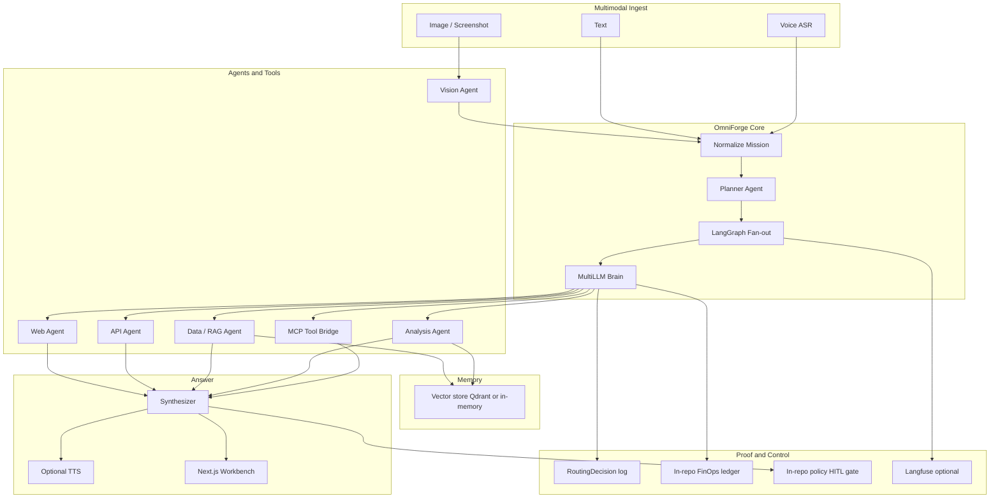

# OmniForge Architecture

**Ask anything. Right agents. Right models.**

OmniForge is a **self-contained** multimodal multi-agent multi-LLM answer platform. One monorepo owns ingest → plan → fan-out → Multi-LLM Brain → synthesize → proof. It does **not** call other vpeetla-ai services at runtime.

| | |
|--|--|
| **Live UI** | [omniforge-flame.vercel.app](https://omniforge-flame.vercel.app) |
| **API** | [omniforge-api.onrender.com](https://omniforge-api.onrender.com/health) |
| **Repo ADR** | [ADR-001](adr/ADR-001-omniforge-self-contained-multimodal-multi-llm.md) |
| **Portfolio ADR** | [ADR-027](https://github.com/vpeetla-ai/ai-architecture-portfolio/blob/main/adr/ADR-027-omniforge-self-contained-multimodal-multi-llm.md) |

---

## Problem

Most LLM apps hardcode one model and one chat box. Real asks are multimodal (text, screenshot, voice) and need:

1. **Specialized agents** (web, API, data, analysis, vision)
2. **Tools / MCP** for side lookups
3. **The right model per step** (cost / latency / quality)
4. **Proof** — which model ran, how long, how much

Without (3) and (4), “multi-LLM” is marketing. OmniForge makes routing an architecture decision with a visible waterfall.

---

## System context (single repo)

Canonical source: [`diagrams/canonical-architecture.mmd`](diagrams/canonical-architecture.mmd)



---

## Request path (60 seconds)

1. **Ingest** — text and/or image and/or voice transcript → `Mission`
2. **Planner** — chooses agents + MCP tools (not a fixed always-on fan-out)
3. **Vision** (if image) — caption/OCR into mission context
4. **Parallel mid-agents** — web / api / data via async gather
5. **Analysis** — reasoning over prior findings
6. **Synthesizer** — final answer
7. **Proof** — every LLM call appends a `RoutingDecision` to the waterfall; optional A/B (`routed` vs `single`)

API: `POST /v1/ask` · A/B: `POST /v1/ask/ab`

---

## Core design decisions

1. **Universal Ask** — War Room / Incident / Chart are presets, not separate products.
2. **Task-class multi-LLM routing** — agents request a `RouteBucket`; Brain resolves provider; never hardcode a model in an agent node.
3. **In-repo everything** — FinOps ledger, policy gate, RAG, MCP bridge, voice ingest live here (may be thinner than sibling products; status table is honest).
4. **A/B is first-class** — same graph, `mode=single|routed`.
5. **Fail-closed profile** — `PRODUCTION_STRICT` denies export without gate approval; demo may fail-open with labels.
6. **No sibling runtime deps** — OpenAI / Anthropic / Groq / Google are external providers, not org repos.

---

## Multi-LLM Brain

| Bucket | Cascade (env-driven) | Typical steps |
|--------|----------------------|---------------|
| `fast` | Groq Llama → Google Gemini → OpenAI mini → mock | Web summarize |
| `structured` | OpenAI mini → Google → Claude Haiku → mock | API / JSON / tools |
| `reasoning` | Claude Sonnet → OpenAI → Google → Groq → mock | Analysis / synthesizer |
| `vision` | OpenAI GPT-4o → Google → Claude → mock | Screenshots |

Missing keys → next candidate → **mock**. UI labels `mocked: true` when mock ran. Cascade misses can appear in mock text as `[cascade misses: …]` for debugging.

Each call emits:

```text
RoutingDecision { step, bucket, provider, model_id, reason, latency_ms, tokens_*, cost_usd, mocked }
```

---

## Agents and tools

| Agent | Role |
|-------|------|
| `vision` | Image / screenshot understanding |
| `web` | Public signals + allowlisted HTTP fetch |
| `api` | Structured enrichment |
| `data` | In-memory (or Qdrant) RAG retrieve |
| `analysis` | Trade-offs and recommendation |
| `synthesizer` | Final architect-facing answer |

**MCP bridge (in-process):** `mcp_time`, `mcp_echo`, `mcp_calc`, `mcp_http_get` (allowlisted hosts). External MCP servers are future work.

---

## Proof and control

| Module | Path | Behavior |
|--------|------|----------|
| FinOps | `omniforge/finops/` | Per-ask budget (`OMNIFORGE_BUDGET_USD`); halt when exceeded |
| Gateway | `omniforge/gateway/` | Export authorization; `PRODUCTION_STRICT` deny-by-default |
| Observability | `omniforge/observability/` | Optional Langfuse when keys set |
| Waterfall | response field | Primary Principal proof artifact in the UI |

---

## Deploy topology

```text
Browser (Vercel static UI)
    → POST /v1/ask
FastAPI (Render)
    → Planner → Agents/MCP → Multi-LLM Brain → Synthesizer
    → RoutingDecision[] + answer
```

Free-tier cold start on Render may take ~30s on first request after idle.

---

## Monorepo map

```text
omniforge/
├── api/main.py                 # FastAPI surface
├── omniforge/
│   ├── ingest/                 # Normalize multimodal mission
│   ├── plan/                   # Agent/tool selection
│   ├── brain/                  # Buckets, cascade, RoutingDecision
│   ├── agents/                 # web, api, data, analysis, vision, synth
│   ├── tools/ + mcp/           # Allowlisted tools + bridge
│   ├── rag/                    # Memory store
│   ├── finops/ + gateway/      # Budget + export gate
│   └── graph/ask.py            # Ask + A/B orchestration
├── ui/                         # Next.js static Ask workbench
└── docs/                       # This file + ADRs + diagrams
```

---

## Non-goals

- Runtime dependency on VAP, VoiceForge, AegisAI, agent-finops, Enterprise RAG
- Replacing the full org portfolio (OmniForge answers one stack question)
- Unbounded crawl or ungoverned email/publish
- Claiming live providers when the cascade fell through to mock

---

## Related

- [DEPLOY.md](DEPLOY.md)
- [SLO.md](SLO.md)
- [ADR-001](adr/ADR-001-omniforge-self-contained-multimodal-multi-llm.md)
- Case study: [omniforge.md](https://github.com/vpeetla-ai/ai-architecture-portfolio/blob/main/case-studies/omniforge.md)
